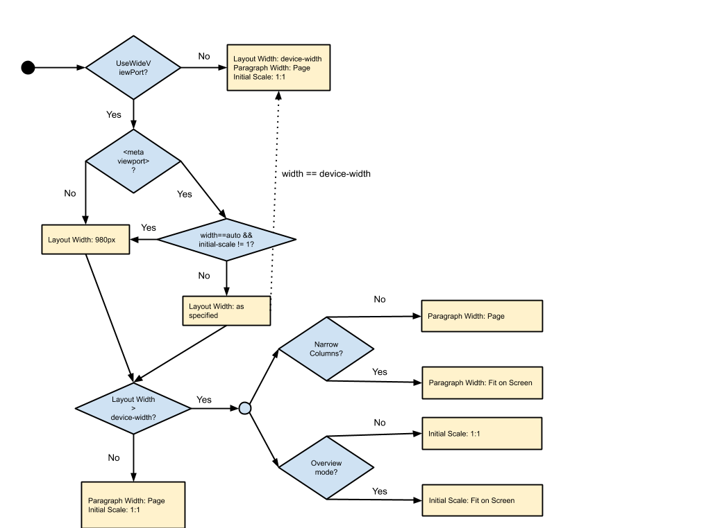

# Web Page Layout

This page explains various settings and algorithms that affect web page layout
in WebView. The purpose is to provide an understanding of what WebView API
methods really do and how are they connected to each other (as their
documentation is terse to be said at best), so we can provide proper substitutes
for them in our implementation.

[TOC]

## WebView APIs

The
[WebSettings](https://developer.android.com/reference/android/webkit/WebSettings)
class exposes several options to configure webpage layout.

| WebSettings method        | Description |
| ------------------------- | ----------- |
| `setLayoutAlgorithm`      | Sets the underlying layout algorithm:<ul><li>`NORMAL` means no rendering changes.</li><li>`NARROW_COLUMNS` makes all columns no wider than the screen if possible.</li><li>`SINGLE_COLUMN` moves all content into one column that is the width of the view **(deprecated)**.</li></ul>The default algorithm is **`NARROW_COLUMNS`**. |
| `setLoadWithOverviewMode` | Sets whether the WebView loads pages in overview mode. The default is **false**. |
| `setTextZoom`             | Sets the text zoom of the page in percent. The default is **100%** (no zoom).    |
| `setUseWideViewPort`      | Tells the WebView to use a wide viewport. The default is **false**. |

It seems that the best systematic approach to describe the effects of changing
the layout settings, is to express their influence on the following 4 layout
parameters that in their own turn change how the page looks on the screen. The
layout parameters we will be using are as follows.

| Parameter | Explanation |
| --------- | ----------- |
| Layout width | The width of the viewport in CSS (aka device-independent) pixels. The notion of a pixel is pretty much overloaded in the mobile world. By CSS pixels, we mean the “pixels” that are used in CSS declarations such as `width: 300px` or `font-size: 14px`. These pixels have nothing to do with the actual device screen resolution, and they are not affected by zooming of the content. |
| Maximum paragraph width | By default, a paragraph block in HTML tends to occupy the full width of the page. As we will see, layout settings can alter this behavior to make paragraphs fit the screen width. |
| Initial viewport scale | In the mobile world, viewport width is always fixed, but user is usually allowed to change the scale of the viewport. |
| Font scale | As opposed to the viewport scale, which is applied to the entire page contents, font scale is applied to fonts only. |

### Hardware Specs

Besides knowing the size of the screen in hardware pixels, for mobile devices
one also needs to know the screen density. For example, the screen of Nexus 7
has 800 x 1205 pixels, with density of 1.33. That means, its "natural" width is
about 600 x 900 dips. These numbers are used when one specifies "device-width"
and "device-height" dimensions for "meta viewport" tag.

### The Decision Diagram

Below is the diagram for how WebView sets layout parameters. Depending on the
case, some of the settings may or may not affect the result.



<!-- diagram source:
http://shortn/_XCjQkmBEmg
-->

*** aside
Elements with a large fixed width can expand the layout width from the normal
value (980 or device-width). This can happen when a mobile site includes a huge
image for example. We respect the implied width of the page instead of the one
stated by the viewport tag; this makes us robust to website administrator
mistakes.
***

Font Scale is only affected by the TextZoom setting.

## Configuring WebView like a browser

WebView can approximate Chrome for Android's behavior with:

```java
WebSettings settings = myWebView.getSettings();
settings.setUseWideViewPort(true);
settings.setLoadWithOverviewMode(true);
settings.setLayoutAlgorithm(WebSettings.LayoutAlgorithm.TEXT_AUTOSIZING);
```

[System WebView Shell](webview-shell.md) is currently configured with these
settings.

### Chrome for Android behavior in detail

Chrome for Android works a little differently from WebView. One of the important
differences is that Chrome for Android doesn't have the `NARROW_COLUMNS` layout
mode, and instead provides font autosizing. The table below describes how Clank
sets the layout parameters depending on the page viewport specification.

| Viewport | Parameters |
| -------- | ---------- |
| No viewport tag | Layout Width: 980px<br>Paragraph Width: Page<br>Initial Scale: Fit on Screen<br>Font Scale: AutoSized |
| `viewport content="width=device-width"`  | Layout Width: device-width<br>Paragraph Width: Page<br>Initial Scale: 1.0<br>Font Scale: 1.0 |
| `viewport wide content` | Viewport Width: As specified<br>Paragraph Width: Page<br>Initial Scale: ?<br>Font Scale: AutoSized |
